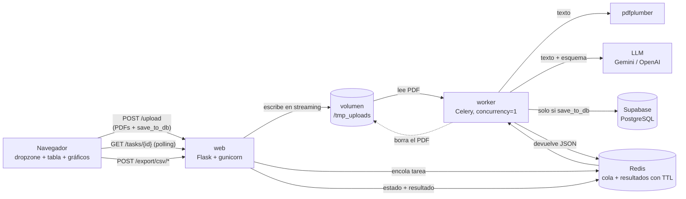

# PDF Process Pipeline — Intelligent Document Processing (IDP)


Sube muchos PDF a la vez y obtén sus datos estructurados. Cada documento se **clasifica**
(factura, boleta, contrato, cartola, liquidación, CV, informe…), se extrae su texto y un LLM
(Gemini por defecto) lo convierte en JSON validado. El resultado se ve en tablas y gráficos, se
exporta a CSV y, si quieres, se guarda en Supabase.

Está diseñado para correr en un **servidor de 2 GB de RAM**: los documentos se procesan de uno
en uno, cada servicio tiene un límite de memoria y los PDF se borran apenas se procesan.

> **Estado:** en construcción, paso a paso. Hoy funcionan la configuración, la app web mínima
> (`/health`), el esquema de extracción y la base de datos en Supabase. El avance detallado está en la
> [hoja de ruta](02-DOCS/wiki/ftd/idp-mvp.md).

---

## Índice

- [Qué hace](#qué-hace)
- [Arquitectura](#arquitectura)
- [Diseñado para 2 GB de RAM](#diseñado-para-2-gb-de-ram)
- [Puesta en marcha](#puesta-en-marcha)
- [Configuración (`.env`)](#configuración-env)
- [Desarrollo: tests y calidad](#desarrollo-tests-y-calidad)
- [Ruff: qué es y cómo se usa](#ruff-qué-es-y-cómo-se-usa)
- [Estructura del proyecto](#estructura-del-proyecto)
- [Convenciones](#convenciones)
- [Seguridad](#seguridad)
- [Documentación interna y harness](#documentación-interna-y-harness)

---

## Qué hace

### Tipos de documento

El LLM primero clasifica el PDF y luego rellena **solo** la sección de ese tipo
([`app/schemas.py`](app/schemas.py)):

| Tipo | Ejemplos | Datos que extrae |
|---|---|---|
| `invoice` | Facturas, cuentas de servicios | Emisor, cliente, RUT/tax ID, fechas, subtotal, impuestos, total, moneda, líneas de detalle |
| `receipt` | Boletas, tickets | Igual que factura |
| `purchase_order` | Órdenes de compra | Igual que factura |
| `quote` | Cotizaciones, presupuestos | Igual que factura (vencimiento de la oferta) |
| `bank_statement` | Cartolas bancarias | Banco, titular, **solo últimos 4 dígitos** de la cuenta, período, saldos, abonos y cargos |
| `contract` | Contratos | Partes y roles, vigencia, valor, renovación automática, aviso de término, ley aplicable, obligaciones |
| `payslip` | Liquidaciones de sueldo | Empleador, empleado, período, bruto, descuentos, líquido |
| `resume` | CVs | Nombre, contacto, cargo, experiencia, habilidades, idiomas, estudios |
| `report` | Informes | Título, autor, fecha, período, hallazgos clave |
| `other` | Cualquier otro | Título y resumen |

Todos incluyen `document_type`, `language`, `title` y un `summary` breve. Funciona con
documentos en cualquier idioma: montos como números, fechas en `YYYY-MM-DD` y monedas en ISO 4217.

### Dos modos de procesamiento

Al subir los archivos eliges:

| Modo | Qué pasa con los datos |
|---|---|
| **Persistente** | Se guardan en PostgreSQL (Supabase) y además se muestran en pantalla. |
| **Efímero** | **Nunca tocan la base de datos.** Viven temporalmente en Redis (expiran) y en el navegador. |

En ambos modos el PDF se borra del disco al terminar su tarea.

### Exportar y visualizar

- **Tabla y gráficos en vivo** (Chart.js) a medida que cada documento termina.
- **CSV individual**: un documento (sus líneas de detalle como filas).
- **CSV unificado**: todo el lote, una fila por documento.

---

## Arquitectura



**Flujo de un documento:**

1. El navegador sube los PDF. `web` los escribe **en trozos** al volumen compartido `/tmp_uploads`
   (nunca el archivo entero en RAM) y encola una tarea de Celery por archivo.
2. El `worker` toma **una tarea a la vez**: extrae el texto con `pdfplumber`, lo envía al LLM
   junto con el esquema (`DocumentSchema`) y recibe JSON validado por Pydantic.
3. Si el modo es persistente, guarda el resultado en Supabase.
4. Devuelve el JSON: Celery lo guarda en Redis por un tiempo limitado.
5. Borra el PDF del disco, pase lo que pase.
6. El navegador consulta el estado de cada tarea (Pending → Processing → Completed/Failed) y,
   al completarse, muestra los datos y habilita los CSV.

| Pieza | Tecnología | Rol |
|---|---|---|
| Web / UI | Flask 3.1 + Jinja2, gunicorn | Subida, estado, exportación CSV |
| Cola | Celery 5.6 + Redis 8 | Procesamiento en segundo plano, resultados temporales |
| Extracción de texto | pdfplumber | Texto de PDF digitales |
| LLM | Gemini (`google-genai`), OpenAI opcional | Clasificar y extraer datos estructurados |
| Validación | Pydantic v2, pydantic-settings | Esquema de salida y configuración |
| Base de datos | Supabase (PostgreSQL 17) + SQLAlchemy 2 + psycopg 3 | Persistencia (modo persistente) |
| Contenedores | Docker Compose | Todo el sistema con límites de memoria |
| Dependencias | Poetry | `pyproject.toml` + `poetry.lock` reproducibles |

---

## Diseñado para 2 GB de RAM

| Medida | Dónde | Por qué |
|---|---|---|
| Límite de memoria por servicio: web 384M, worker 768M, redis 128M (**total 1280M**) | `docker-compose.yml` | Deja ~700 MB para el sistema y Docker |
| `--concurrency=1` y `--prefetch-multiplier=1` | worker | Un PDF a la vez, sin reservar tareas de más |
| `--max-tasks-per-child=20` | worker | Reinicia el proceso cada 20 tareas y libera memoria acumulada |
| Subida en streaming a disco | web | Lotes grandes sin cargar archivos en RAM |
| Borrado del PDF al terminar cada tarea | worker | El disco no se llena |
| Redis `noeviction` + `appendonly` | redis | Nunca descarta tareas encoladas; sobreviven a un reinicio |
| Sin contenedor de PostgreSQL | — | La base vive en Supabase |

---

## Puesta en marcha

### Requisitos

- **Docker** con Compose. En macOS sin Docker Desktop:
  ```bash
  brew install colima docker docker-compose
  colima start --cpu 2 --memory 2 --disk 30
  ```
  (`--memory 2` imita el servidor de producción.)
- Un proyecto en **Supabase** y una API key de **Gemini** ([aistudio.google.com/apikey](https://aistudio.google.com/apikey)).

No necesitas Python ni Poetry en tu máquina: todo corre en contenedores.

### Pasos

```bash
git clone <url-del-repo>
cd pdf_process_pipeline
cp .env.sample .env        # luego rellena GEMINI_API_KEY y DATABASE_URL
docker compose up --build web redis
```

Abre <http://localhost:8000/health> → `{"status": "ok"}`.

Crea la tabla en Supabase (una sola vez; se puede repetir sin riesgo):

```bash
docker compose run --rm --no-deps web python -m app.db
```

> El servicio `worker` se levantará con `docker compose up --build` cuando exista
> `app/tasks.py` (paso 10 de la hoja de ruta).

Comandos útiles:

```bash
docker compose logs -f web      # ver logs
docker compose ps               # estado y salud de cada servicio
docker stats --no-stream        # consumo de memoria real
docker compose down             # apagar
```

---

## Configuración (`.env`)

Todas las variables están documentadas en [`.env.sample`](.env.sample). `.env` está en
`.gitignore`: **nunca se sube al repo**. La configuración se valida al arrancar
([`app/config.py`](app/config.py)); si falta algo, la app no arranca y dice qué falta.

| Variable | Ejemplo | Descripción |
|---|---|---|
| `LLM_PROVIDER` | `gemini` | `gemini` u `openai` |
| `LLM_MODEL` | `gemini-3.1-flash-lite` | Modelo del proveedor elegido |
| `GEMINI_API_KEY` | — | Obligatoria si `LLM_PROVIDER=gemini` |
| `OPENAI_API_KEY` | — | Obligatoria si `LLM_PROVIDER=openai` |
| `DATABASE_URL` | `postgresql+psycopg://postgres.<ref>:<pass>@aws-0-<region>.pooler.supabase.com:5432/postgres` | Conexión a Supabase |
| `CELERY_BROKER_URL` | `redis://redis:6379/0` | Redis dentro de Compose |
| `UPLOAD_DIR` | `/tmp_uploads` | Volumen compartido web ↔ worker |
| `MAX_UPLOAD_MB` | `50` | Tamaño máximo por PDF |

### ¿Qué cadena de conexión de Supabase usar?

En el dashboard: **Connect → Connection String**. Hay tres; usa el **Session pooler**:

| Opción | Puerto | Uso |
|---|---|---|
| Direct connection | 5432 | ❌ Solo IPv6: muchos VPS y redes Docker no llegan |
| **Session pooler** | **5432** | ✅ IPv4, conexiones largas (web + worker) |
| Transaction pooler | 6543 | ❌ Para serverless; rompe los *prepared statements* de psycopg 3 |

### Cambiar de proveedor de LLM

1. En `.env`: `LLM_PROVIDER=openai`, `LLM_MODEL=<modelo>` y `OPENAI_API_KEY=...`
2. Reconstruye la imagen incluyendo el SDK opcional:
   ```bash
   docker compose build --build-arg POETRY_EXTRAS=openai
   ```

No hay que tocar código: todos los proveedores usan la misma interfaz y el mismo esquema.

---

## Desarrollo: tests y calidad

El proyecto se desarrolla con **TDD**: primero un test que falla (🔴), luego el código mínimo
que lo hace pasar (🟢). Las herramientas corren dentro de una imagen `dev`:

```bash
# Una vez (o cuando cambien las dependencias)
docker build -f docker/Dockerfile --target dev -t pdf-process-pipeline:dev .

# Tests + cobertura
docker run --rm -v "$PWD":/src -w /src pdf-process-pipeline:dev pytest

# Formatear y revisar estilo
docker run --rm -v "$PWD":/src -w /src pdf-process-pipeline:dev ruff format app tests
docker run --rm -v "$PWD":/src -w /src pdf-process-pipeline:dev ruff check app tests

# Tipos
docker run --rm -v "$PWD":/src -w /src pdf-process-pipeline:dev mypy app tests

# Tests de integración contra tu Supabase real (lee .env)
docker run --rm --env-file .env -v "$PWD":/src -w /src pdf-process-pipeline:dev pytest -m integration
```

| Herramienta | Qué verifica | Exigencia |
|---|---|---|
| **pytest** + pytest-cov | Que el código hace lo que debe | Todo pasa; cobertura ≥ 70 % en código cambiado |
| **ruff** | Estilo y errores comunes | Cero avisos |
| **mypy** | Que los tipos (`str`, `int`, `Settings`…) cuadran | Cero errores |

El código se monta en `/src` para que no tape el entorno virtual de la imagen (`/app/.venv`).

### Dependencias con Poetry

- Se declaran en [`pyproject.toml`](pyproject.toml) y se fijan en `poetry.lock` (versiones exactas).
- Grupos: dependencias de producción, grupo `dev` (pytest, ruff, mypy) y el extra opcional `openai`.
- Sin Poetry local, se usa desde un contenedor, por ejemplo para añadir un paquete:
  ```bash
  docker run --rm -v "$PWD":/work -w /work python:3.12-slim \
    sh -c 'pip install -q poetry==2.5.1 && poetry add <paquete>'
  ```

---

## Ruff: qué es y cómo se usa

[**Ruff**](https://docs.astral.sh/ruff/) es un analizador y formateador de código Python
escrito en Rust (muy rápido). Tiene **dos trabajos distintos**:

| Comando | Qué hace | Analogía |
|---|---|---|
| `ruff check` | **Linter**: detecta errores y malas prácticas (imports sin usar, variables no definidas, imports desordenados, sintaxis antigua, líneas demasiado largas…) y los **reporta** | Corrector ortográfico |
| `ruff format` | **Formateador**: **reescribe** el código con un estilo uniforme (espacios, comillas, saltos de línea) | "Autoformato" de un editor |

**Por qué se usa:** todo el código se ve igual lo escriba quien lo escriba, y las revisiones se
centran en la lógica, no en espacios.

**Configuración** (en `pyproject.toml`):

```toml
[tool.ruff]
line-length = 120          # ancho máximo de línea, contando comentarios

[tool.ruff.lint]
select = ["E", "F", "I", "B", "UP", "SIM"]
```

| Regla | Qué revisa |
|---|---|
| `E` | Estilo PEP 8 (p. ej. `E501`: línea demasiado larga) |
| `F` | Errores reales: nombres no definidos, imports sin usar |
| `I` | Orden de los imports |
| `B` | Bugs frecuentes (bugbear), p. ej. argumentos mutables por defecto |
| `UP` | Sintaxis moderna de Python (`str \| None` en vez de `Optional[str]`) |
| `SIM` | Simplificaciones de código |

**Comentarios a la derecha del código:** están permitidos. El límite de 120 caracteres deja
espacio para ellos; el formateador cuenta el comentario dentro del ancho, así que si una línea
con comentario pasa de 120, `ruff format` partiría el código para hacerle sitio. `ruff format`
también pone automáticamente los **dos espacios antes del `#`** que pide PEP 8:

```python
app.extensions["settings"] = settings or get_settings()  # get_settings() is cached: .env is read once per process
```

**Flujo recomendado:** después de editar, `ruff format` (arregla solo) y luego `ruff check`
(lo que quede, lo corriges tú o con `ruff check --fix`).

---

## Estructura del proyecto

```
pdf_process_pipeline/
├── app/
│   ├── __init__.py          ✅ create_app(): app factory de Flask + /health
│   ├── config.py            ✅ Configuración validada desde .env
│   ├── schemas.py           ✅ DocumentSchema: lo que el LLM debe devolver
│   ├── db.py, models.py     ✅ Conexión a Supabase y tabla documents (RLS activado)
│   ├── storage.py           ⏳ Subida en streaming a /tmp_uploads
│   ├── pdf_text.py          ⬜ Texto con pdfplumber
│   ├── llm/                 ⬜ Interfaz común + Gemini + OpenAI + selector
│   ├── tasks.py             ⬜ Tarea Celery (extraer → LLM → guardar → borrar PDF)
│   ├── export.py            ⬜ CSV individual y unificado
│   └── web/                 ⬜ Rutas, plantillas Jinja2, JS y gráficos
├── tests/                   Tests (pytest)
├── docker/Dockerfile        Imagen multi-etapa: builder → dev → runtime
├── docker-compose.yml       web + worker + redis con límites de memoria
├── pyproject.toml           Dependencias (Poetry) y configuración de ruff/mypy/pytest
├── poetry.lock              Versiones exactas
├── .env.sample              Plantilla de configuración documentada
├── 02-DOCS/wiki/            Constitución, decisiones y hoja de ruta
└── CLAUDE.md / GEMINI.md    Índice para asistentes de IA
```

✅ hecho · ⏳ en curso · ⬜ pendiente

---

## Convenciones

- **Idioma:** código, variables, funciones y comentarios **en inglés**; documentación para el
  equipo en español.
- **Ramas:** el trabajo se hace en ramas (`feat/...`) y se integra a `main` solo tras pasar
  tests, ruff y mypy.
- **Commits:** [gitmoji](https://gitmoji.dev) + Conventional Commits, con un asunto descriptivo
  que empieza con un verbo en imperativo:
  ```
  ✨ feat(config): add validated settings loaded from .env
  🐳 build(docker): add multi-stage Dockerfile, .dockerignore and poetry.lock
  🎨 style(ruff): raise line length to 120 to allow comments to the right of code
  ```
- **Decisiones importantes** se registran en [`02-DOCS/wiki/sdd/decisions.md`](02-DOCS/wiki/sdd/decisions.md).

---

## Seguridad

- **Secretos** solo en `.env` (ignorado por git y por `.dockerignore`, nunca entra a la imagen);
  la configuración usa `SecretStr` para no mostrarlos en logs.
- **Contenedor sin root**: la app corre como `appuser`.
- **Supabase**: la tabla `documents` tiene Row Level Security activado (sin políticas), así la
  API pública de Supabase no la expone; la app se conecta como dueña de la tabla.
- **Privacidad**: de las cuentas bancarias solo se guardan los últimos 4 dígitos; el modo
  efímero nunca escribe en la base de datos.
- **CSV**: las celdas que empiezan con `=`, `+`, `-` o `@` se escapan (inyección de fórmulas
  en Excel).
- **Vulnerabilidades**: dependencias escaneadas con [Trivy](https://trivy.dev) (0 CVE en
  `poetry.lock`); la imagen base se revisa en cada versión
  ([decisión registrada](02-DOCS/wiki/sdd/decisions.md)).

---

## Documentación interna y harness

- [`02-DOCS/wiki/sdd/constitution.md`](02-DOCS/wiki/sdd/constitution.md): reglas no negociables
  del proyecto (stack, calidad, límites de RAM, seguridad).
- [`02-DOCS/wiki/sdd/decisions.md`](02-DOCS/wiki/sdd/decisions.md): registro de decisiones con
  alternativas y motivos.
- [`02-DOCS/wiki/ftd/idp-mvp.md`](02-DOCS/wiki/ftd/idp-mvp.md): hoja de ruta paso a paso con
  evidencia de cada paso.

El proyecto usa [rsc-harness](https://ericrisco.github.io/rsc-harness/) para configurar
asistentes de IA (Claude Code y Gemini CLI): skills, agentes revisores y hooks. En git solo va
la declaración (`.rsc.json`); los archivos generados (`.rsc/`, enlaces en `.claude/` y
`.gemini/`) son locales. Tras clonar, se regeneran con:

```bash
npx @ericrisco/rsc@latest sync
```
