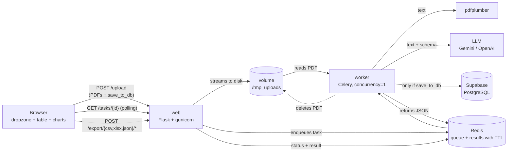

# PDF Process Pipeline — Intelligent Document Processing (IDP)


Upload many PDFs at once and get their data back as structured JSON. Each document is
**classified** (invoice, receipt, contract, bank statement, payslip, resume, report…), its text
is extracted and an LLM (Gemini by default) turns it into validated JSON. Results show up as
tables and charts, can be exported to CSV and, if you choose, are saved to Supabase.

It is built to run on a **2 GB RAM server**: documents are processed one at a time, every
service has a memory limit and PDFs are deleted as soon as they are processed.

> **Status:** under construction, step by step. Working today: configuration, the minimal web
> app (`/health`), the extraction schema, the Supabase database, streaming upload storage, PDF text extraction, LLM
> extraction with Gemini (≈ USD 0.0006 per invoice) and the Celery worker that processes each PDF
> in persistent or ephemeral mode, CSV/XLSX/JSON export, the HTTP API and the browser UI. Detailed progress lives in
> the [roadmap](02-DOCS/wiki/ftd/idp-mvp.md).

---

## Contents

- [What it does](#what-it-does)
- [Architecture](#architecture)
- [Built for 2 GB of RAM](#built-for-2-gb-of-ram)
- [Getting started](#getting-started)
- [Configuration (`.env`)](#configuration-env)
- [Development: tests and quality](#development-tests-and-quality)
- [Ruff: what it is and how to use it](#ruff-what-it-is-and-how-to-use-it)
- [Project structure](#project-structure)
- [Conventions](#conventions)
- [Security](#security)
- [Internal docs and AI harness](#internal-docs-and-ai-harness)

---

## What it does

### Document types

The LLM first classifies the PDF and then fills **only** the section for that type
([`app/schemas.py`](app/schemas.py)):

| Type | Examples | Extracted data |
|---|---|---|
| `invoice` | Invoices, utility bills | Issuer, customer, tax ID (RUT, VAT…), dates, subtotal, taxes, total, currency, line items |
| `receipt` | Receipts, sales tickets | Same as invoice |
| `purchase_order` | Purchase orders | Same as invoice |
| `quote` | Quotes, estimates | Same as invoice (offer expiry date) |
| `bank_statement` | Bank statements | Bank, holder, **last 4 account digits only**, period, balances, credits and debits |
| `contract` | Contracts | Parties and roles, term, value, auto-renewal, termination notice, governing law, key obligations |
| `payslip` | Payslips | Employer, employee, period, gross pay, deductions, net pay |
| `resume` | Resumes / CVs | Name, contact, title, experience, skills, languages, education |
| `report` | Reports | Title, author, date, period, key findings |
| `other` | Anything else | Title and summary |

Every result also has `document_type`, `language`, `title` and a short `summary`. Documents can
be in any language: amounts come back as numbers, dates as `YYYY-MM-DD` and currencies as ISO
4217 codes.

### Two processing modes

The user picks one when uploading:

| Mode | What happens to the data |
|---|---|
| **Persistent** | Saved to PostgreSQL (Supabase) and shown on screen. |
| **Ephemeral** | **Never touches the database.** Lives temporarily in Redis (it expires) and in the browser. |

In both modes the PDF is deleted from disk when its task finishes.

### Export and visualize

- **Live table and charts** (Chart.js) as each document finishes.
- **Three export formats**, each for one document or for the whole batch:

| Format | Best for | Details |
|---|---|---|
| **CSV** | Any tool, databases, scripts | UTF-8 with BOM (accents display in Excel), streamed row by row |
| **XLSX** | Excel, Google Sheets, LibreOffice | Numbers and dates keep their type (sum, filter, sort), leading zeros such as `004512` survive, bold frozen header with filters |
| **JSON** | Other systems and APIs | The original nested structure, one object per document |

- **Individual** export: one document; invoices, receipts, orders and quotes get one row per line item.
- **Unified** export: the whole batch, one row per document, always with the same 64 columns (derived
  from the schema), so exports from different batches can be stacked in a spreadsheet.

---

## Architecture



**Life of a document:**

1. The browser uploads the PDFs. `web` writes them **in chunks** to the shared `/tmp_uploads`
   volume (never the whole file in RAM) and enqueues one Celery task per file.
2. The `worker` takes **one task at a time**: it extracts the text with `pdfplumber`, sends it to
   the LLM together with the schema (`DocumentSchema`) and gets back JSON validated by Pydantic.
3. In persistent mode it saves the result to Supabase.
4. It returns the JSON: Celery keeps it in Redis for a limited time.
5. It deletes the PDF from disk, whatever the outcome.
6. The browser polls each task's status (Pending → Processing → Completed/Failed) and, once
   completed, shows the data and enables the CSV buttons.

| Piece | Technology | Role |
|---|---|---|
| Web / UI | Flask 3.1 + Jinja2, gunicorn | Upload, status, export |
| Export | csv (stdlib), XlsxWriter, json | CSV, XLSX and JSON downloads |
| Queue | Celery 5.6 + Redis 8 | Background processing, temporary results |
| Text extraction | pdfplumber | Text from digital PDFs (scanned PDFs need OCR, not in the MVP) |
| LLM | Gemini (`google-genai`), optional OpenAI | Classify and extract structured data |
| Validation | Pydantic v2, pydantic-settings | Output schema and configuration |
| Database | Supabase (PostgreSQL 17) + SQLAlchemy 2 + psycopg 3 | Storage (persistent mode) |
| Containers | Docker Compose | The whole system, with memory limits |
| Dependencies | Poetry | Reproducible `pyproject.toml` + `poetry.lock` |

### HTTP API

| Method | Path | Body | Response |
|---|---|---|---|
| `POST` | `/upload` | multipart: `files` (1–50 PDFs), `save_to_db` (`true`/`false`, default `false`) | `202` `{"save_to_db", "tasks": [{"task_id", "filename"}], "rejected": [{"filename", "error"}]}` |
| `GET` | `/tasks/<task_id>` | — | `{"task_id", "status": "pending"\|"processing"\|"completed"\|"failed", "result"?, "error"?}`; `404` if the task is not yours |
| `POST` | `/export/{csv\|xlsx\|json}/individual` | JSON `{"filename", "document"}` | File download in that format |
| `POST` | `/export/{csv\|xlsx\|json}/unified` | JSON `{"items": [{"filename", "document"}, …]}` (1–500) | File download in that format |
| `GET` | `/health` | — | `{"status": "ok"}` |

```bash
curl -c cookies.txt -F "files=@invoice.pdf" -F "save_to_db=false" http://localhost:8000/upload
curl -b cookies.txt http://localhost:8000/tasks/<task_id>
```

The session cookie matters: `/tasks/<id>` only answers the browser (cookie) that uploaded the file.

---

## Built for 2 GB of RAM

| Measure | Where | Why |
|---|---|---|
| Per-service memory limits: web 384M, worker 768M, redis 128M (**1280M total**) | `docker-compose.yml` | Leaves ~700 MB for the OS and Docker |
| `--concurrency=1` and `--prefetch-multiplier=1` | worker | One PDF at a time, no extra tasks reserved |
| `--max-tasks-per-child=20` | worker | Restarts the process every 20 tasks to release accumulated memory |
| Streaming uploads to disk | web | Large batches without loading files into RAM |
| PDF deleted when each task finishes | worker | The disk never fills up |
| Redis `noeviction` + `appendonly` | redis | Queued tasks are never dropped and survive a restart |
| No PostgreSQL container | — | The database lives in Supabase |

---

## Getting started

### Requirements

- **Docker** with Compose. On macOS without Docker Desktop:
  ```bash
  brew install colima docker docker-compose
  colima start --cpu 2 --memory 2 --disk 30
  ```
  (`--memory 2` mimics the production server.)
- A **Supabase** project and a **Gemini** API key ([aistudio.google.com/apikey](https://aistudio.google.com/apikey)).

You do not need Python or Poetry on your machine: everything runs in containers.

### Steps

```bash
git clone <repo-url>
cd pdf_process_pipeline
cp .env.sample .env        # then fill in GEMINI_API_KEY and DATABASE_URL
docker compose up --build
```

Open <http://localhost:8000> and drop some PDFs. Health check: <http://localhost:8000/health> →
`{"status": "ok"}`.

Create the table in Supabase (once; running it again is safe):

```bash
docker compose run --rm --no-deps web python -m app.db
```

Useful commands:

```bash
docker compose logs -f web      # follow web logs
docker compose logs -f worker   # follow the worker processing documents
docker compose ps               # status and health of each service
docker stats --no-stream        # real memory usage
docker compose down             # stop everything
```

---

## Configuration (`.env`)

Every variable is documented in [`.env.sample`](.env.sample). `.env` is in `.gitignore`:
**it is never committed**. Configuration is validated at startup ([`app/config.py`](app/config.py));
if something is missing, the app refuses to start and says what is missing.

| Variable | Example | Description |
|---|---|---|
| `LLM_PROVIDER` | `gemini` | `gemini` or `openai` |
| `LLM_MODEL` | `gemini-3.1-flash-lite` | Model of the selected provider |
| `GEMINI_API_KEY` | — | Required when `LLM_PROVIDER=gemini` |
| `OPENAI_API_KEY` | — | Required when `LLM_PROVIDER=openai` |
| `DATABASE_URL` | `postgresql://postgres.<ref>:<pass>@aws-0-<region>.pooler.supabase.com:5432/postgres` | Supabase connection (paste it as shown; the app switches it to the psycopg 3 driver) |
| `CELERY_BROKER_URL` | `redis://redis:6379/0` | Task queue (Redis inside Compose) |
| `CELERY_RESULT_BACKEND` | `redis://redis:6379/1` | Where task results (the extracted JSON) are kept |
| `RESULT_TTL_SECONDS` | `3600` | How long results stay in Redis; ephemeral data exists only there and in the browser |
| `UPLOAD_DIR` | `/tmp_uploads` | Volume shared by web and worker |
| `MAX_UPLOAD_MB` | `50` | Maximum size per PDF |
| `SECRET_KEY` | — | **Required**, ≥ 32 chars: signs the session cookie that ties tasks to a browser. Generate with `python3 -c "import secrets; print(secrets.token_urlsafe(48))"` |
| `SESSION_COOKIE_SECURE` | `false` | `true` in production (HTTPS only) |

### Which Supabase connection string?

In the dashboard: **Connect → Connection String**. There are three; use the **Session pooler**:

| Option | Port | Use |
|---|---|---|
| Direct connection | 5432 | ❌ IPv6 only: many VPS and Docker networks cannot reach it |
| **Session pooler** | **5432** | ✅ IPv4, long-lived connections (web + worker) |
| Transaction pooler | 6543 | ❌ Meant for serverless; breaks psycopg 3 prepared statements |

### Switching LLM provider

1. In `.env`: `LLM_PROVIDER=openai`, `LLM_MODEL=<model>` and `OPENAI_API_KEY=...`
2. Rebuild the image with the optional SDK:
   ```bash
   docker compose build --build-arg POETRY_EXTRAS=openai
   ```

No code changes: every provider uses the same interface and the same schema.

---

## Development: tests and quality

The project is built with **TDD**: first a failing test (🔴), then the minimum code that makes
it pass (🟢). The tools run inside a `dev` image:

```bash
# Once (or whenever dependencies change)
docker build -f docker/Dockerfile --target dev -t pdf-process-pipeline:dev .

# Tests + coverage
docker run --rm -v "$PWD":/src -w /src pdf-process-pipeline:dev pytest

# Format and lint
docker run --rm -v "$PWD":/src -w /src pdf-process-pipeline:dev ruff format app tests
docker run --rm -v "$PWD":/src -w /src pdf-process-pipeline:dev ruff check app tests

# Types
docker run --rm -v "$PWD":/src -w /src pdf-process-pipeline:dev mypy app tests

# Integration tests against your real Supabase and LLM provider (reads .env; costs < USD 0.01)
docker run --rm --env-file .env -v "$PWD":/src -w /src pdf-process-pipeline:dev pytest -m integration
```

| Tool | What it checks | Bar |
|---|---|---|
| **pytest** + pytest-cov | The code does what it should | All green; ≥ 70% coverage on changed code |
| **ruff** | Style and common mistakes | Zero findings |
| **mypy** | Types (`str`, `int`, `Settings`…) line up | Zero errors |

The code is mounted at `/src` so it does not hide the image's virtualenv (`/app/.venv`).

### Dependencies with Poetry

- Declared in [`pyproject.toml`](pyproject.toml) and pinned in `poetry.lock` (exact versions).
- Groups: production dependencies, a `dev` group (pytest, ruff, mypy) and the optional `openai` extra.
- Without a local Poetry, run it from a container, e.g. to add a package:
  ```bash
  docker run --rm -v "$PWD":/work -w /work python:3.12-slim \
    sh -c 'pip install -q poetry==2.5.1 && poetry add <package>'
  ```

---

## Ruff: what it is and how to use it

[**Ruff**](https://docs.astral.sh/ruff/) is a Python linter and formatter written in Rust (very
fast). It does **two different jobs**:

| Command | What it does | Analogy |
|---|---|---|
| `ruff check` | **Linter**: finds bugs and bad practices (unused imports, undefined names, unsorted imports, outdated syntax, overlong lines…) and **reports** them | Spell checker |
| `ruff format` | **Formatter**: **rewrites** the code in one consistent style (spacing, quotes, line breaks) | An editor's auto-format |

**Why use it:** all code looks the same no matter who wrote it, so reviews focus on logic, not
whitespace.

**Configuration** (in `pyproject.toml`):

```toml
[tool.ruff]
line-length = 120          # maximum line width, comments included

[tool.ruff.lint]
select = ["E", "F", "I", "B", "UP", "SIM"]
```

| Rule set | What it checks |
|---|---|
| `E` | PEP 8 style (e.g. `E501`: line too long) |
| `F` | Real errors: undefined names, unused imports |
| `I` | Import order |
| `B` | Common bugs (bugbear), e.g. mutable default arguments |
| `UP` | Modern Python syntax (`str \| None` instead of `Optional[str]`) |
| `SIM` | Code simplifications |

**Comments to the right of code** are allowed. The 120-character limit leaves room for them;
the formatter counts the comment in the line width, so if a commented line goes past 120,
`ruff format` would split the code to make room. `ruff format` also adds the **two spaces before
`#`** that PEP 8 asks for:

```python
app.extensions["settings"] = settings or get_settings()  # get_settings() is cached: .env is read once per process
```

**Recommended flow:** after editing, run `ruff format` (fixes things itself), then `ruff check`
(fix what is left by hand or with `ruff check --fix`).

---

## Project structure

```
pdf_process_pipeline/
├── app/
│   ├── __init__.py          ✅ create_app(): Flask app factory + /health
│   ├── config.py            ✅ Settings validated from .env
│   ├── schemas.py           ✅ DocumentSchema: what the LLM must return
│   ├── db.py, models.py     ✅ Supabase connection and documents table (RLS on)
│   ├── storage.py           ✅ Streaming upload to /tmp_uploads
│   ├── pdf_text.py          ✅ Text extraction with pdfplumber
│   ├── llm/                 ✅ Common interface + Gemini + OpenAI + selector
│   ├── tasks.py             ✅ Celery task (extract → LLM → save → delete PDF)
│   ├── export.py            ✅ Individual and unified export: CSV, XLSX, JSON
│   ├── celery_app.py        ✅ Celery app shared by web (enqueue) and worker (run)
│   └── web/                 ✅ HTTP API, task ownership, Jinja2 page, JS and charts
├── tests/                   Tests (pytest)
├── docker/Dockerfile        Multi-stage image: builder → dev → runtime
├── docker-compose.yml       web + worker + redis with memory limits
├── pyproject.toml           Dependencies (Poetry) and ruff/mypy/pytest config
├── poetry.lock              Exact versions
├── .env.sample              Documented configuration template
├── 02-DOCS/wiki/            Constitution, decisions and roadmap
└── CLAUDE.md / GEMINI.md    Index for AI assistants
```

✅ done · ⏳ in progress · ⬜ pending

---

## Conventions

- **Language:** everything in the repository is in **English** — code, identifiers, comments,
  docs and commit messages.
- **Branches:** work happens on branches (`feat/...`) and reaches `main` only after tests, ruff
  and mypy pass.
- **Commits:** [Conventional Commits](https://www.conventionalcommits.org), no emoji, with a
  descriptive subject that starts with an imperative verb:
  ```
  feat(config): add validated settings loaded from .env
  feat(llm): add provider-agnostic LLM extraction with Gemini and optional OpenAI
  docs(readme): translate README to English
  ```
- **Significant decisions** are logged in [`02-DOCS/wiki/sdd/decisions.md`](02-DOCS/wiki/sdd/decisions.md).

---

## Security

- **Secrets** only in `.env` (ignored by git and by `.dockerignore`, so it never enters the
  image); settings use `SecretStr` so secrets never show up in logs.
- **Non-root container**: the app runs as `appuser`.
- **Browser hardening**: a Content-Security-Policy with no inline scripts (only our files and the
  pinned Chart.js from jsDelivr, verified with Subresource Integrity), `X-Content-Type-Options:
  nosniff`, `Referrer-Policy: no-referrer` and no framing. Document data is always inserted as
  text, never as HTML, so a malicious PDF cannot inject scripts into the page.
- **Task ownership** (no user accounts yet): each browser gets a random owner token in a signed
  session cookie (`HttpOnly`, `SameSite=Lax`, `Secure` in production) and only that browser can
  read its tasks; any other request for a task id gets `404`. Ownership expires with the results.
- **No access logs of task URLs**: gunicorn runs without an access log, so task ids do not end up
  in log files.
- **Supabase**: the `documents` table has Row Level Security enabled (no policies), so
  Supabase's public REST API cannot read it; the app connects as the table owner.
- **Privacy**: only the last 4 digits of bank accounts are stored; ephemeral mode never writes
  to the database.
- **Exports**: CSV text cells starting with `=`, `+`, `-` or `@` are escaped, and XLSX writes text as
  plain string cells, so a malicious PDF cannot inject spreadsheet formulas.
- **Vulnerabilities**: dependencies scanned with [Trivy](https://trivy.dev) (0 CVEs in
  `poetry.lock`); the base image is reviewed on every release
  ([logged decision](02-DOCS/wiki/sdd/decisions.md)).

---

## Internal docs and AI harness

- [`02-DOCS/wiki/sdd/constitution.md`](02-DOCS/wiki/sdd/constitution.md): the project's
  non-negotiable rules (stack, quality, RAM limits, security).
- [`02-DOCS/wiki/sdd/decisions.md`](02-DOCS/wiki/sdd/decisions.md): decision log with
  alternatives and reasons.
- [`02-DOCS/wiki/ftd/idp-mvp.md`](02-DOCS/wiki/ftd/idp-mvp.md): step-by-step roadmap with the
  evidence for each step.

The project uses [rsc-harness](https://ericrisco.github.io/rsc-harness/) to configure AI
assistants (Claude Code and Gemini CLI): skills, reviewer agents and hooks. Only the declaration
(`.rsc.json`) is committed; generated files (`.rsc/`, links in `.claude/` and `.gemini/`) are
machine-local. After cloning, regenerate them with:

```bash
npx @ericrisco/rsc@latest sync
```
