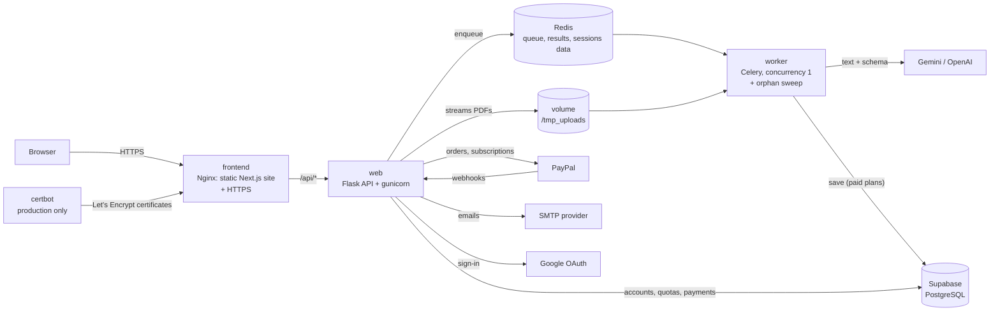

# Extracta — Intelligent Document Processing


Upload PDFs and get their data back as structured JSON, tables, charts and Excel/CSV/JSON files.
Each document is **classified** (invoice, receipt, contract, bank statement, payslip, resume,
report…), its text is extracted and an LLM (Gemini by default) turns it into validated data.

Extracta is a complete SaaS: accounts (email + password or Google) with email verification and
password recovery, a free plan and four cheap paid plans with daily quotas, PayPal monthly
subscriptions or one-time passes, and an admin panel to approve accounts and assign privileges. It is built to run on a **2 GB RAM server** behind automatic HTTPS.

- **Deploy it**: [docs/DEPLOY.md](docs/DEPLOY.md) — from an empty VPS to HTTPS, step by step.
- **Progress and decisions**: [roadmap](02-DOCS/wiki/ftd/idp-mvp.md),
  [accounts and billing](02-DOCS/wiki/ftd/accounts-billing-nextjs.md),
  [decision log](02-DOCS/wiki/sdd/decisions.md).

---

## Contents

- [Features](#features)
- [Plans](#plans)
- [Architecture](#architecture)
- [Run it locally](#run-it-locally)
- [Deploy to production](#deploy-to-production)
- [Configuration (`.env`)](#configuration-env)
- [Administration](#administration)
- [HTTP API](#http-api)
- [Development: tests and quality](#development-tests-and-quality)
- [Ruff: what it is and how to use it](#ruff-what-it-is-and-how-to-use-it)
- [Project structure](#project-structure)
- [Security](#security)
- [Conventions](#conventions)

---

## Features

| Area | What you get |
|---|---|
| **Extraction** | 10 document types in any language: invoices, receipts, purchase orders, quotes, bank statements, contracts, payslips, resumes, reports and "other". Amounts as numbers, dates as `YYYY-MM-DD`, currencies as ISO 4217. |
| **Processing modes** | *Process only*: nothing is stored, results expire after 1 hour. *Save to history* (paid plans): results are kept in the account. The PDF file is deleted right after processing in both modes. |
| **Exports** | Excel (XLSX with typed numbers and dates), CSV (UTF-8 with BOM) and JSON, per document or for the whole batch. |
| **Dashboard** | Drag and drop, upload progress, live status per document, detail view, charts by type and by currency, saved history. |
| **Accounts** | Email + password or Google sign-in, email verification, forgot/reset/change password. Optional manual approval of new accounts. |
| **Plans** | Charged per page. Free (10 pages every 24 hours), pay-as-you-go page packs that never expire, and four monthly subscriptions (cancel anytime). |
| **Admin** | `/admin` with `ADMIN_PASSWORD`: approve/reject/suspend accounts, assign plans with or without expiry, custom daily limits, payments and stats. |

Document types and extracted fields:

| Type | Extracted data |
|---|---|
| `invoice`, `receipt`, `purchase_order`, `quote` | Issuer, customer, tax IDs, dates, subtotal, taxes, total, currency, line items |
| `bank_statement` | Bank, holder, **last 4 account digits only**, period, balances, credits and debits |
| `contract` | Parties and roles, term, value, auto-renewal, termination notice, governing law, key obligations |
| `payslip` | Employer, employee, period, gross pay, deductions, net pay |
| `resume` | Name, contact, title, experience, skills, languages, education |
| `report` | Title, author, date, period, key findings |
| `other` | Title and summary |

## Plans and pages

Usage is measured in **PDF pages**: every page of every processed document counts once, and a
document that fails gives its pages back. Defined in [`app/plans.py`](app/plans.py) (the frontend
catalog is generated from it and a test fails if they drift).

| Plan | Price | Pages | Pages per PDF | MB per file | Files per upload | Save to history |
|---|---|---|---|---|---|---|
| Free | $0 | 10 every 24 h | 10 | 10 | 2 | — |
| Starter | $1.99 / month | 300 every 30 days | 30 | 20 | 10 | ✓ |
| Pro | $4.99 / month | 1,000 every 30 days | 60 | 50 | 25 | ✓ |
| Business | $9.99 / month | 2,500 every 30 days | 100 | 50 | 50 | ✓ |
| Ultra | $19.99 / month | 6,000 every 30 days | 150 | 50 | 50 | ✓ |

**Pay as you go**: page packs of 100 ($0.99), 250 ($1.99), 500 ($3.49), 1,000 ($5.99), 2,500
($12.99) and 5,000 ($22.99) pages. Prepaid pages never expire, are spent after the plan's pages,
and unlock PDFs of up to 100 pages and saving to the history. Every plan and pack covers its
worst-case LLM cost (≈ USD 0.0006 per page with Gemini Flash-Lite), which is checked by a test.

---

## Architecture



| Piece | Technology | Role |
|---|---|---|
| Frontend | Next.js 16 (static export), React 19, Tailwind CSS 4, Recharts | The website and dashboard; no Node.js at runtime |
| Edge | Nginx 1.30 + certbot (Let's Encrypt) | Nginx serves the site, proxies `/api` and terminates HTTPS; certbot obtains and renews the certificates |
| API | Flask 3.1, gunicorn (2 × 4 threads) | Accounts, quotas, uploads, task status, exports, admin, billing |
| Queue | Celery 5.6 + Redis 8 | One document at a time, results with a TTL, periodic cleanup |
| Extraction | pdfplumber + Gemini (`google-genai`), optional OpenAI | Text, then structured data validated by Pydantic |
| Database | Supabase PostgreSQL + SQLAlchemy 2 + Alembic | Accounts, usage, payments, saved documents (Row Level Security on) |
| Payments / sign-in | PayPal Orders v2 + Subscriptions + webhooks, Google OAuth 2.0 (PKCE) | Optional; enabled by `.env` |
| Email | Any SMTP provider (logs locally) | Verification, password reset, security notices |

**Memory on a 2 GB server** (limits in `docker-compose.yml`): frontend 64 MB, web 384 MB,
worker 768 MB, redis 128 MB, plus certbot 128 MB in production: 1344 MB locally, 1472 MB in
production. Measured under load: ~4 / 210 / 240 / 14 MB.

---

## Run it locally

Requirements: Docker with Compose (macOS without Docker Desktop:
`brew install colima docker docker-compose && colima start --cpu 2 --memory 2 --disk 30`),
a Supabase project and a Gemini API key. No Python or Node.js needed on your machine.

```bash
git clone https://github.com/AESMatias/Extracta.git
cd Extracta
cp .env.sample .env          # fill GEMINI_API_KEY, DATABASE_URL, SECRET_KEY, ADMIN_PASSWORD
docker compose up -d --build
./scripts/docker-cleanup.sh  # optional: free the disk space used by the build
```

Open <http://localhost:8080>. The API migrates the database on start. `/admin` uses
`ADMIN_PASSWORD`.

Useful commands:

```bash
docker compose ps                      # status and health
docker compose logs -f web worker      # follow the API and the worker
docker stats --no-stream               # real memory usage
docker compose down                    # stop (volumes are kept)
```

**Frontend with hot reload** (optional, needs Node.js 22): run the stack, publish the API port
temporarily or run Flask locally, then `cd frontend && npm install && API_ORIGIN=http://localhost:8000 npm run dev`.

---

## Deploy to production

The full reference is [docs/DEPLOY.md](docs/DEPLOY.md). This is the short path for a server that
already hosts other sites (for example apps under pm2) with its own Nginx in front. Run every
command on the server, in the project folder, unless it says otherwise.

### 1. Prepare the server (once)

```bash
curl -fsSL https://get.docker.com | sh                       # Docker with Compose
swapon --show                                                # must list 2 GB of swap; if empty:
fallocate -l 2G /swapfile && chmod 600 /swapfile && mkswap /swapfile && swapon /swapfile && echo '/swapfile none swap sw 0 0' >> /etc/fstab
apt install -y nginx certbot python3-certbot-nginx           # the server's Nginx and certbot
ufw allow OpenSSH && ufw allow 80/tcp && ufw allow 443/tcp   # only SSH, HTTP and HTTPS
```

Check who owns ports 80 and 443 with `ss -tlnp | grep -E ':(80|443)\s'`. Any app listening there
directly must move behind Nginx first (for example `--host 127.0.0.1 --port 8001`, then
`pm2 save`), because Nginx has to own both ports.

### 2. Point the domain

Create an **A record** for the subdomain (e.g. `pdf`) with the server's public IPv4
(`curl -4 ifconfig.me`). On Cloudflare, set it to **DNS only (grey cloud)**: its proxy caps
uploads at 100 MB and waits at most 100 s, and a Cloudflare Tunnel (CNAME to `cfargotunnel.com`)
bypasses the server. Check it with `dig +short pdf.example.com @1.1.1.1`: it must print only
the server's IP.

### 3. Get the code and configure it

```bash
git clone https://github.com/AESMatias/Extracta.git && cd Extracta
cp .env.sample .env && chmod 600 .env && nano .env
```

Values that matter in this setup (every variable is explained inside `.env`):

| Variable | Value |
|---|---|
| `GEMINI_API_KEY`, `DATABASE_URL`, `ADMIN_PASSWORD` | your key, the Supabase Session pooler URL, a long password (quote it with `'...'` if it has a `$`) |
| `SECRET_KEY` | `python3 -c "import secrets; print(secrets.token_urlsafe(48))"` |
| `PUBLIC_BASE_URL` | `https://pdf.example.com` (no trailing slash) |
| `SESSION_COOKIE_SECURE` | `true` |
| `SITE_DOMAIN`, `COMPOSE_PROFILES` | empty (the server's certbot handles HTTPS) |
| `HTTP_PORT` / `HTTPS_PORT` | `127.0.0.1:8080` / `127.0.0.1:8443` (only the server's Nginx can reach them) |
| `REAL_IP_FROM` | `172.16.0.0/12` (trust the visitor address the server's Nginx sends) |
| `SMTP_*`, `MAIL_FROM` | your email provider, e.g. Resend: `smtp.resend.com`, 587, `starttls`, user `resend`, password = API key |
| `PAYPAL_*` | see [Payments](docs/DEPLOY.md#9-optional-payments-with-paypal) |
| `GOOGLE_CLIENT_ID`, `GOOGLE_CLIENT_SECRET` | optional: Sign in with Google |

Containers read `.env` only when they are created. **After any later change to `.env`** (SMTP,
PayPal or Google keys...), apply it with `docker compose up -d --force-recreate web worker` and
check with `docker compose exec web printenv | grep SMTP_HOST`; no rebuild is needed.

### 4. Start it

```bash
docker compose build          # 5-10 minutes on a small server
docker compose up -d
docker compose ps             # web and redis healthy, frontend and worker up
curl -I http://127.0.0.1:8080 # 200
```

### 5. Put it behind the server's Nginx, with HTTPS

```bash
cat > /etc/nginx/sites-available/extracta <<'EOF'
server {
    listen 80;
    server_name pdf.example.com;
    client_max_body_size 2600m;

    location / {
        proxy_pass http://127.0.0.1:8080;
        proxy_http_version 1.1;
        proxy_set_header Host $host;
        proxy_set_header X-Forwarded-For $remote_addr;
        proxy_set_header X-Forwarded-Proto $scheme;
        proxy_request_buffering off;
        proxy_read_timeout 130s;
        proxy_send_timeout 130s;
    }
}
EOF
ln -sf /etc/nginx/sites-available/extracta /etc/nginx/sites-enabled/
nginx -t && systemctl reload nginx
certbot --nginx -d pdf.example.com   # must say: deployed certificate ... to .../sites-enabled/extracta
curl -I https://pdf.example.com      # 200, text/html
```

`server_name` must be the real domain: if no site matches it, certbot installs the certificate in
the default site instead. Renewal is automatic.

### 6. Update: one command

```bash
./deploy/deploy.sh          # pull main, build, restart, wait until healthy, roll back if not
./deploy/deploy.sh --force  # rebuild even without new commits (fresh security patches)
```

A failed build restarts nothing; a version that is not healthy within 4 minutes is replaced by the
previous images and commit automatically.

### 7. Automatic deploys: push to main → production

The `deploy` job in `.github/workflows/ci.yml` runs `deploy/deploy.sh` over SSH after every push
to `main` whose backend and frontend checks pass (skipped until `DEPLOY_HOST` exists). Set it up
once:

```bash
# On the server, in the project folder: a key that can only run the deploy script
ssh-keygen -t ed25519 -N "" -C github-actions-deploy -f ~/.ssh/extracta_deploy
echo "command=\"$PWD/deploy/deploy.sh\",no-port-forwarding,no-X11-forwarding,no-agent-forwarding,no-pty $(cat ~/.ssh/extracta_deploy.pub)" >> ~/.ssh/authorized_keys
cat ~/.ssh/extracta_deploy                                                   # -> secret DEPLOY_SSH_KEY
echo "$(curl -4 -s ifconfig.me) $(cut -d' ' -f1,2 /etc/ssh/ssh_host_ed25519_key.pub)"  # -> secret DEPLOY_KNOWN_HOSTS
```

In GitHub → **Settings → Secrets and variables → Actions**: secrets `DEPLOY_SSH_KEY` and
`DEPLOY_KNOWN_HOSTS` (the two outputs above), variables `DEPLOY_HOST` (the server's IP) and
`DEPLOY_USER` (`root`). Then delete the private key from the server with
`rm ~/.ssh/extracta_deploy`. From then on: push or merge to `main`, and **Actions** shows the
tests and **Deploy to production**; **Deployments → production** keeps the history.

### Troubleshooting

| Symptom | Fix |
|---|---|
| `failed to bind host port 0.0.0.0:80: address already in use` | Another program owns port 80: use `HTTP_PORT=127.0.0.1:8080` and the server's Nginx (steps 3 and 5). |
| certbot: `Invalid response ... 404` from a `2606:4700:...` address | The domain goes through Cloudflare's proxy or a Tunnel: A record, grey cloud (step 2). |
| certbot: `no valid A records found` | The record is a Tunnel CNAME, not an A record (step 2). |
| The HTTPS site shows another app | The certificate went to the wrong Nginx site: fix `server_name` in `sites-available/extracta`, remove the domain from other sites, `nginx -t && systemctl reload nginx`, then `certbot --nginx -d DOMAIN --reinstall`. |
| Every visitor has a `172.x` address in `docker compose logs frontend` | `REAL_IP_FROM` is missing from `.env`. |
| Pay button: "PayPal is not available right now" | Run the check in [docs/DEPLOY.md](docs/DEPLOY.md#9-optional-payments-with-paypal); `PAYEE_ACCOUNT_RESTRICTED` means PayPal has not finished verifying your business account. |
| The build stops with `Killed` | Not enough memory: turn on swap (step 1). |
| A change to `.env` has no effect (e.g. Resend shows no logs at all) | The containers still use the old values: `docker compose up -d --force-recreate web worker`. |
| Confirmation or password emails never arrive | Run the email check in [docs/DEPLOY.md](docs/DEPLOY.md#7-email-required-in-production): it sends one message and prints the provider's answer. |

---

## Configuration (`.env`)

Every variable is documented in [`.env.sample`](.env.sample); `.env` and any copy of it are
git-ignored. Settings are validated at startup ([`app/config.py`](app/config.py)): a missing or
invalid value stops the app with a clear message.

| Group | Variables |
|---|---|
| LLM | `LLM_PROVIDER` (`gemini`/`openai`), `LLM_MODEL`, `GEMINI_API_KEY`, `OPENAI_API_KEY` |
| Database | `DATABASE_URL` (Supabase **Session pooler**, pasted as shown) |
| Site | `PUBLIC_BASE_URL`, `SITE_DOMAIN`, `LETSENCRYPT_EMAIL`, `COMPOSE_PROFILES`, `HTTP_PORT`, `HTTPS_PORT` |
| Sessions | `SECRET_KEY` (≥ 32 chars), `SESSION_COOKIE_SECURE` (`true` with HTTPS) |
| Accounts | `REQUIRE_MANUAL_APPROVAL`, `REQUIRE_EMAIL_VERIFICATION`, `ADMIN_PASSWORD` (≥ 12 chars; empty disables /admin) |
| Email | `SMTP_HOST` (empty = emails go to the logs), `SMTP_PORT`, `SMTP_USERNAME`, `SMTP_PASSWORD`, `SMTP_SECURITY`, `MAIL_FROM` |
| Google sign-in | `GOOGLE_CLIENT_ID`, `GOOGLE_CLIENT_SECRET` (redirect URI: `PUBLIC_BASE_URL/api/auth/google/callback`) |
| PayPal | `PAYPAL_ENV` (`sandbox`/`live`), `PAYPAL_CLIENT_ID`, `PAYPAL_CLIENT_SECRET`, `PAYPAL_WEBHOOK_ID` |
| Queue | `CELERY_BROKER_URL`, `CELERY_RESULT_BACKEND`, `RESULT_TTL_SECONDS` |
| Uploads | `UPLOAD_DIR`, `MAX_UPLOAD_MB`, `ORPHAN_MAX_AGE_HOURS` |

To switch the LLM to OpenAI: set `LLM_PROVIDER=openai`, `LLM_MODEL` and `OPENAI_API_KEY`, then
`docker compose build --build-arg POETRY_EXTRAS=openai web`.

---

## Administration

Open `/admin` and enter `ADMIN_PASSWORD` (5 attempts per 15 minutes; the admin session lasts
2 hours and is separate from user accounts). For every account you see its status, effective
plan, **explicit privileges** (PDFs per 24 h, MB per file, files per upload, save to history),
usage, sign-in methods and payments, and you can:

- **Approve / reject / suspend**: rejected and suspended accounts are signed out at once.
- **Assign a plan** (e.g. premium for free) with an expiry date or none.
- **Set a custom daily limit** that overrides the plan's.
- **Handle deletion requests**: every request from the public `/delete-account` form is listed in
  the *Deletion requests* tab, even when the confirmation email never arrived (for example with
  SMTP unset). Confirm with the owner from the account's address, then press *Delete account*
  (or *Dismiss*); a request closes by itself when the owner uses the emailed link. Requests sent
  to the contact address by email are handled from the account's edit panel (*Delete account*).

With `REQUIRE_MANUAL_APPROVAL=true`, new accounts wait as *pending* (they can sign in but not
upload) until you approve them.

---

## HTTP API

All routes are under `/api` and use the session cookie (`HttpOnly`, `SameSite=Lax`, `Secure` in
production). State-changing requests from other origins are refused.

| Method | Path | Purpose |
|---|---|---|
| `POST` | `/api/auth/register`, `/api/auth/login`, `/api/auth/logout` | Accounts (JSON) |
| `GET` | `/api/auth/me` | Current account with plan and usage (`user: null` when signed out) |
| `GET` | `/api/auth/google/login` → `/api/auth/google/callback` | Google sign-in |
| `POST` | `/api/auth/email/verify`, `/api/auth/email/resend` | Email verification |
| `POST` | `/api/auth/password/forgot`, `/api/auth/password/reset`, `/api/auth/password/change` | Passwords |
| `POST` | `/api/upload?save_to_db=true\|false` | Multipart `files`; plan and quota enforced |
| `POST` | `/api/tasks/status` | `{"task_ids": [...]}` → status and result of your tasks |
| `GET` | `/api/tasks/<id>` | One task (404 if it is not yours) |
| `GET`, `DELETE` | `/api/documents`, `/api/documents/<id>` | Saved history |
| `POST` | `/api/export/{csv\|xlsx\|json}/{individual\|unified}` | File downloads |
| `GET` | `/api/plans`, `/api/billing/config`, `/api/billing/payments` | Plans and your payments |
| `POST` | `/api/billing/orders`, `/api/billing/orders/<id>/capture` | One-time pass (PayPal) |
| `POST` | `/api/billing/subscriptions`, `/api/billing/subscriptions/<id>/activate`, `/api/billing/subscription/cancel` | Monthly subscription (PayPal) |
| `POST` | `/api/billing/webhook` | PayPal events (signature verified with PayPal) |
| `*` | `/api/admin/...` | Admin (session from `ADMIN_PASSWORD`) |
| `GET` | `/api/health` | Health check |

---

## Development: tests and quality

The backend is built test-first. Unit tests use an in-memory SQLite database and fakes for
Redis, Celery, Google and PayPal; integration tests hit the real Supabase and Gemini.

```bash
# Backend (inside the dev image: no local Python needed)
docker build -f docker/Dockerfile --target dev -t pdf-process-pipeline:dev .
docker run --rm -v "$PWD":/src -w /src pdf-process-pipeline:dev pytest
docker run --rm -v "$PWD":/src -w /src pdf-process-pipeline:dev ruff format app tests
docker run --rm -v "$PWD":/src -w /src pdf-process-pipeline:dev ruff check app tests
docker run --rm -v "$PWD":/src -w /src pdf-process-pipeline:dev mypy app tests
docker run --rm --env-file .env -v "$PWD":/src -w /src pdf-process-pipeline:dev pytest -m integration

# Frontend
docker run --rm -v "$PWD/frontend":/app -w /app node:22-alpine sh -c "npm ci && npx tsc --noEmit && npx eslint . && npm run build"

# Database migrations (applied automatically when the web container starts)
docker compose run --rm --no-deps web python -m app.migrate
```

| Tool | Checks | Bar |
|---|---|---|
| pytest + pytest-cov | Behavior (250+ tests) | All green; ≥ 70% coverage on changed code (currently ~95%) |
| ruff | Style and common bugs | Zero findings |
| mypy | Types | Zero errors |
| tsc + eslint | Frontend types and React rules | Zero errors |
| Trivy | Known vulnerabilities with an available fix | Zero HIGH/CRITICAL in both images |

**CI** ([.github/workflows/ci.yml](.github/workflows/ci.yml)) runs all of the above on every push
and pull request and scans both images every Monday. **Dependabot** proposes weekly updates for
Python, npm, Docker base images and GitHub Actions.

Dependencies are managed with **Poetry** (`pyproject.toml` + `poetry.lock`) and **npm**
(`frontend/package-lock.json`).

---

## Ruff: what it is and how to use it

[**Ruff**](https://docs.astral.sh/ruff/) is a Python linter and formatter written in Rust. It does
two different jobs:

| Command | What it does | Analogy |
|---|---|---|
| `ruff check` | **Linter**: finds bugs and bad practices (unused imports, undefined names, unsorted imports, outdated syntax, overlong lines…) and **reports** them | Spell checker |
| `ruff format` | **Formatter**: **rewrites** the code in one consistent style | An editor's auto-format |

Configuration (`pyproject.toml`): `line-length = 120` (comments included) and rule sets `E`
(PEP 8), `F` (real errors), `I` (import order), `B` (common bugs), `UP` (modern syntax) and `SIM`
(simplifications). Comments to the right of code are welcome as long as the line fits in 120
characters; `ruff format` adds the two spaces before `#` that PEP 8 asks for.

Recommended flow: after editing, `ruff format` (fixes things itself), then `ruff check` (fix the
rest by hand or with `ruff check --fix`).

---

## Project structure

```
├── app/                         Python backend
│   ├── __init__.py              create_app(): the Flask API
│   ├── config.py                Settings validated from .env
│   ├── plans.py                 Plans, prices and privileges
│   ├── accounts.py              Registration, sign-in, Google, passwords, quota
│   ├── billing.py               Passes, subscriptions, refunds, webhooks, reconciliation
│   ├── mail.py, emails.py       SMTP (or logs) and the email templates
│   ├── tokens.py                Signed, expiring links for verification and password reset
│   ├── models.py, db.py         Tables (users, usage, payments, subscriptions, documents...) and sessions
│   ├── migrations/, migrate.py  Alembic migrations (run on start)
│   ├── schemas.py               DocumentSchema: what the LLM must return
│   ├── storage.py               Streaming uploads, orphan sweep
│   ├── pdf_text.py              Text extraction (pdfplumber)
│   ├── llm/                     Gemini, OpenAI and the provider selector
│   ├── celery_app.py, tasks.py  Queue and the processing task
│   ├── export.py                CSV, XLSX and JSON exports
│   └── web/                     Routes: documents, auth, admin, billing, security helpers
├── frontend/                    Next.js site (static export) + nginx/ config + Dockerfile
│   └── src/app/                 /, /login, /register, /app, /pricing, /account, /admin
├── tests/                       pytest suite (unit + integration)
├── docker/Dockerfile            API/worker image: builder → dev → runtime
├── docker/certbot/             Image that gets and renews the HTTPS certificate (production)
├── docker-compose.yml           frontend + web + worker + redis with memory limits
├── docs/DEPLOY.md               Production deployment guide
├── deploy/deploy.sh             Pull, build, restart, health-check and roll back (run by CI on main)
├── scripts/docker-cleanup.sh    Free disk space after builds
└── 02-DOCS/wiki/                Constitution, decisions and roadmaps
```

---

## Security

- **Secrets** only in `.env` (git- and Docker-ignored); `SecretStr` keeps them out of logs.
- **Passwords**: PBKDF2-SHA256 with 600,000 iterations; unknown emails take as long as wrong
  passwords; login, registration, password reset and the admin password are rate limited.
  Changing a password signs out every other session.
- **Email links**: signed and expiring (verification 3 days, reset 1 hour and single-use); the
  token travels after `#`, so it never reaches a server log. "Forgot password" answers the same
  whether the account exists or not, and emails leave on a background thread so timing does not
  tell either. Linking Google to an account whose email was never verified removes its password
  (account pre-hijacking).
- **Sessions**: signed `HttpOnly`, `SameSite=Lax` cookie (`Secure` in production); cross-site
  state-changing requests are refused; rejected or suspended accounts are signed out at once.
- **Authorization**: plans and quotas are enforced on the server before the upload body is read;
  tasks, results and saved documents are only served to their owner (404 otherwise).
- **Payments**: the server sets the price, then verifies owner, plan, amount and currency before
  capturing, and owner and billing plan before activating a subscription; captures are
  idempotent. Webhooks are verified with PayPal using the raw body and applied exactly once.
- **Uploads**: streamed to disk in 64 KB chunks, checked by content (`%PDF-`), stored under
  server-generated names, deleted after processing; a periodic sweep removes orphans.
- **LLM output** is validated against a strict schema; document content never reaches error
  messages; bank accounts keep only their last 4 digits.
- **Exports**: CSV cells that look like formulas are escaped; XLSX writes text as text.
- **Browser**: Content-Security-Policy, `nosniff`, no framing, `Referrer-Policy`; React escapes
  all output and the app never injects HTML.
- **Database**: Row Level Security on every table, so Supabase's public REST API cannot read them.
- **Containers**: non-root API image without pip; Debian and Alpine patches applied on every
  build; Nginx hides its version, refuses TLS for unknown host names and sends HSTS; Trivy: 0 fixable HIGH/CRITICAL vulnerabilities in all three images (API, Nginx, certbot).

---

## Conventions

- Everything in the repository is in **English**: code, comments, docs and commit messages.
- Work happens on branches and reaches `main` through pull requests after CI passes.
- Commits follow [Conventional Commits](https://www.conventionalcommits.org) with a descriptive
  subject that starts with an imperative verb, no emoji.
- Significant decisions are logged in [`02-DOCS/wiki/sdd/decisions.md`](02-DOCS/wiki/sdd/decisions.md).

The repository also carries an [rsc-harness](https://ericrisco.github.io/rsc-harness/)
configuration for AI assistants (Claude Code and Gemini CLI); regenerate its local files after
cloning with `npx @ericrisco/rsc@latest sync`.
