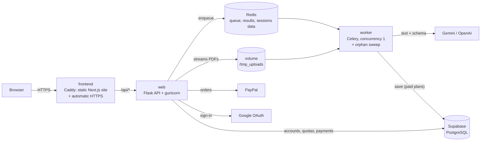

# Extracta — Intelligent Document Processing


Upload PDFs and get their data back as structured JSON, tables, charts and Excel/CSV/JSON files.
Each document is **classified** (invoice, receipt, contract, bank statement, payslip, resume,
report…), its text is extracted and an LLM (Gemini by default) turns it into validated data.

Extracta is a complete SaaS: accounts (email + password or Google), a free plan and four cheap
paid plans with daily quotas, PayPal checkout, and an admin panel to approve accounts and assign
privileges. It is built to run on a **2 GB RAM server** behind automatic HTTPS.

- **Deploy it**: [docs/DEPLOY.md](docs/DEPLOY.md) — from an empty VPS to HTTPS, step by step.
- **Progress and decisions**: [roadmap](02-DOCS/wiki/ftd/idp-mvp.md),
  [accounts and billing](02-DOCS/wiki/ftd/accounts-billing-nextjs.md),
  [decision log](02-DOCS/wiki/sdd/decisions.md).

---

## Contents

- [Features](#features)
- [Plans](#plans)
- [Architecture](#architecture)
- [Run it locally](#run-it-locally)
- [Configuration (`.env`)](#configuration-env)
- [Administration](#administration)
- [HTTP API](#http-api)
- [Development: tests and quality](#development-tests-and-quality)
- [Ruff: what it is and how to use it](#ruff-what-it-is-and-how-to-use-it)
- [Project structure](#project-structure)
- [Security](#security)
- [Conventions](#conventions)

---

## Features

| Area | What you get |
|---|---|
| **Extraction** | 10 document types in any language: invoices, receipts, purchase orders, quotes, bank statements, contracts, payslips, resumes, reports and "other". Amounts as numbers, dates as `YYYY-MM-DD`, currencies as ISO 4217. |
| **Processing modes** | *Process only*: nothing is stored, results expire after 1 hour. *Save to history* (paid plans): results are kept in the account. The PDF file is deleted right after processing in both modes. |
| **Exports** | Excel (XLSX with typed numbers and dates), CSV (UTF-8 with BOM) and JSON, per document or for the whole batch. |
| **Dashboard** | Drag and drop, upload progress, live status per document, detail view, charts by type and by currency, saved history. |
| **Accounts** | Email + password or Google sign-in. Optional manual approval of new accounts. |
| **Plans** | Free (2 PDFs every 24 hours) and four 30-day passes paid with PayPal. |
| **Admin** | `/admin` with `ADMIN_PASSWORD`: approve/reject/suspend accounts, assign plans with or without expiry, custom daily limits, payments and stats. |

Document types and extracted fields:

| Type | Extracted data |
|---|---|
| `invoice`, `receipt`, `purchase_order`, `quote` | Issuer, customer, tax IDs, dates, subtotal, taxes, total, currency, line items |
| `bank_statement` | Bank, holder, **last 4 account digits only**, period, balances, credits and debits |
| `contract` | Parties and roles, term, value, auto-renewal, termination notice, governing law, key obligations |
| `payslip` | Employer, employee, period, gross pay, deductions, net pay |
| `resume` | Name, contact, title, experience, skills, languages, education |
| `report` | Title, author, date, period, key findings |
| `other` | Title and summary |

## Plans

Defined in [`app/plans.py`](app/plans.py) (the frontend catalog is generated from it and a test
fails if they drift). Paid plans are 30-day passes, with no automatic renewal.

| Plan | Price | PDFs / 24 h | MB per file | Files per upload | Save to history |
|---|---|---|---|---|---|
| Free | $0 | 2 | 10 | 2 | — |
| Starter | $1.99 | 25 | 20 | 10 | ✓ |
| Pro | $4.99 | 100 | 50 | 25 | ✓ |
| Business | $9.99 | 250 | 50 | 50 | ✓ |
| Ultra | $19.99 | 600 | 50 | 50 | ✓ |

Every paid plan covers its worst-case LLM cost (≈ USD 0.0006 per document with Gemini
Flash-Lite), which is checked by a test.

---

## Architecture



| Piece | Technology | Role |
|---|---|---|
| Frontend | Next.js 16 (static export), React 19, Tailwind CSS 4, Recharts | The website and dashboard; no Node.js at runtime |
| Edge | Caddy 2.11 (compiled with patched Go) | Serves the site, proxies `/api`, obtains and renews HTTPS certificates |
| API | Flask 3.1, gunicorn (2 × 4 threads) | Accounts, quotas, uploads, task status, exports, admin, billing |
| Queue | Celery 5.6 + Redis 8 | One document at a time, results with a TTL, periodic cleanup |
| Extraction | pdfplumber + Gemini (`google-genai`), optional OpenAI | Text, then structured data validated by Pydantic |
| Database | Supabase PostgreSQL + SQLAlchemy 2 + Alembic | Accounts, usage, payments, saved documents (Row Level Security on) |
| Payments / sign-in | PayPal Orders v2, Google OAuth 2.0 (PKCE) | Optional; enabled by `.env` |

**Memory on a 2 GB server** (limits in `docker-compose.yml`, total 1344 MB): frontend 64 MB,
web 384 MB, worker 768 MB, redis 128 MB. Measured under load: ~12 / 210 / 240 / 14 MB.

---

## Run it locally

Requirements: Docker with Compose (macOS without Docker Desktop:
`brew install colima docker docker-compose && colima start --cpu 2 --memory 2 --disk 30`),
a Supabase project and a Gemini API key. No Python or Node.js needed on your machine.

```bash
git clone https://github.com/AESMatias/Extracta.git
cd Extracta
cp .env.sample .env          # fill GEMINI_API_KEY, DATABASE_URL, SECRET_KEY, ADMIN_PASSWORD
docker compose up -d --build
./scripts/docker-cleanup.sh  # optional: free the disk space used by the build
```

Open <http://localhost:8080>. The API migrates the database on start. `/admin` uses
`ADMIN_PASSWORD`.

Useful commands:

```bash
docker compose ps                      # status and health
docker compose logs -f web worker      # follow the API and the worker
docker stats --no-stream               # real memory usage
docker compose down                    # stop (volumes are kept)
```

**Frontend with hot reload** (optional, needs Node.js 22): run the stack, publish the API port
temporarily or run Flask locally, then `cd frontend && npm install && API_ORIGIN=http://localhost:8000 npm run dev`.

---

## Configuration (`.env`)

Every variable is documented in [`.env.sample`](.env.sample); `.env` and any copy of it are
git-ignored. Settings are validated at startup ([`app/config.py`](app/config.py)): a missing or
invalid value stops the app with a clear message.

| Group | Variables |
|---|---|
| LLM | `LLM_PROVIDER` (`gemini`/`openai`), `LLM_MODEL`, `GEMINI_API_KEY`, `OPENAI_API_KEY` |
| Database | `DATABASE_URL` (Supabase **Session pooler**, pasted as shown) |
| Site | `PUBLIC_BASE_URL`, `SITE_ADDRESS`, `HTTP_PORT`, `HTTPS_PORT` |
| Sessions | `SECRET_KEY` (≥ 32 chars), `SESSION_COOKIE_SECURE` (`true` with HTTPS) |
| Accounts | `REQUIRE_MANUAL_APPROVAL`, `ADMIN_PASSWORD` (≥ 12 chars; empty disables /admin) |
| Google sign-in | `GOOGLE_CLIENT_ID`, `GOOGLE_CLIENT_SECRET` (redirect URI: `PUBLIC_BASE_URL/api/auth/google/callback`) |
| PayPal | `PAYPAL_ENV` (`sandbox`/`live`), `PAYPAL_CLIENT_ID`, `PAYPAL_CLIENT_SECRET` |
| Queue | `CELERY_BROKER_URL`, `CELERY_RESULT_BACKEND`, `RESULT_TTL_SECONDS` |
| Uploads | `UPLOAD_DIR`, `MAX_UPLOAD_MB`, `ORPHAN_MAX_AGE_HOURS` |

To switch the LLM to OpenAI: set `LLM_PROVIDER=openai`, `LLM_MODEL` and `OPENAI_API_KEY`, then
`docker compose build --build-arg POETRY_EXTRAS=openai web`.

---

## Administration

Open `/admin` and enter `ADMIN_PASSWORD` (5 attempts per 15 minutes; the admin session lasts
2 hours and is separate from user accounts). For every account you see its status, effective
plan, **explicit privileges** (PDFs per 24 h, MB per file, files per upload, save to history),
usage, sign-in methods and payments, and you can:

- **Approve / reject / suspend**: rejected and suspended accounts are signed out at once.
- **Assign a plan** (e.g. premium for free) with an expiry date or none.
- **Set a custom daily limit** that overrides the plan's.

With `REQUIRE_MANUAL_APPROVAL=true`, new accounts wait as *pending* (they can sign in but not
upload) until you approve them.

---

## HTTP API

All routes are under `/api` and use the session cookie (`HttpOnly`, `SameSite=Lax`, `Secure` in
production). State-changing requests from other origins are refused.

| Method | Path | Purpose |
|---|---|---|
| `POST` | `/api/auth/register`, `/api/auth/login`, `/api/auth/logout` | Accounts (JSON) |
| `GET` | `/api/auth/me` | Current account with plan and usage (`user: null` when signed out) |
| `GET` | `/api/auth/google/login` → `/api/auth/google/callback` | Google sign-in |
| `POST` | `/api/upload?save_to_db=true\|false` | Multipart `files`; plan and quota enforced |
| `POST` | `/api/tasks/status` | `{"task_ids": [...]}` → status and result of your tasks |
| `GET` | `/api/tasks/<id>` | One task (404 if it is not yours) |
| `GET`, `DELETE` | `/api/documents`, `/api/documents/<id>` | Saved history |
| `POST` | `/api/export/{csv\|xlsx\|json}/{individual\|unified}` | File downloads |
| `GET` | `/api/plans`, `/api/billing/config`, `/api/billing/payments` | Plans and your payments |
| `POST` | `/api/billing/orders`, `/api/billing/orders/<id>/capture` | PayPal checkout |
| `*` | `/api/admin/...` | Admin (session from `ADMIN_PASSWORD`) |
| `GET` | `/api/health` | Health check |

---

## Development: tests and quality

The backend is built test-first. Unit tests use an in-memory SQLite database and fakes for
Redis, Celery, Google and PayPal; integration tests hit the real Supabase and Gemini.

```bash
# Backend (inside the dev image: no local Python needed)
docker build -f docker/Dockerfile --target dev -t pdf-process-pipeline:dev .
docker run --rm -v "$PWD":/src -w /src pdf-process-pipeline:dev pytest
docker run --rm -v "$PWD":/src -w /src pdf-process-pipeline:dev ruff format app tests
docker run --rm -v "$PWD":/src -w /src pdf-process-pipeline:dev ruff check app tests
docker run --rm -v "$PWD":/src -w /src pdf-process-pipeline:dev mypy app tests
docker run --rm --env-file .env -v "$PWD":/src -w /src pdf-process-pipeline:dev pytest -m integration

# Frontend
docker run --rm -v "$PWD/frontend":/app -w /app node:22-alpine sh -c "npm ci && npx tsc --noEmit && npx eslint . && npm run build"

# Database migrations (applied automatically when the web container starts)
docker compose run --rm --no-deps web python -m app.migrate
```

| Tool | Checks | Bar |
|---|---|---|
| pytest + pytest-cov | Behavior (250+ tests) | All green; ≥ 70% coverage on changed code (currently ~95%) |
| ruff | Style and common bugs | Zero findings |
| mypy | Types | Zero errors |
| tsc + eslint | Frontend types and React rules | Zero errors |
| Trivy | Known vulnerabilities with an available fix | Zero HIGH/CRITICAL in both images |

**CI** ([.github/workflows/ci.yml](.github/workflows/ci.yml)) runs all of the above on every push
and pull request and scans both images every Monday. **Dependabot** proposes weekly updates for
Python, npm, Docker base images and GitHub Actions.

Dependencies are managed with **Poetry** (`pyproject.toml` + `poetry.lock`) and **npm**
(`frontend/package-lock.json`).

---

## Ruff: what it is and how to use it

[**Ruff**](https://docs.astral.sh/ruff/) is a Python linter and formatter written in Rust. It does
two different jobs:

| Command | What it does | Analogy |
|---|---|---|
| `ruff check` | **Linter**: finds bugs and bad practices (unused imports, undefined names, unsorted imports, outdated syntax, overlong lines…) and **reports** them | Spell checker |
| `ruff format` | **Formatter**: **rewrites** the code in one consistent style | An editor's auto-format |

Configuration (`pyproject.toml`): `line-length = 120` (comments included) and rule sets `E`
(PEP 8), `F` (real errors), `I` (import order), `B` (common bugs), `UP` (modern syntax) and `SIM`
(simplifications). Comments to the right of code are welcome as long as the line fits in 120
characters; `ruff format` adds the two spaces before `#` that PEP 8 asks for.

Recommended flow: after editing, `ruff format` (fixes things itself), then `ruff check` (fix the
rest by hand or with `ruff check --fix`).

---

## Project structure

```
├── app/                         Python backend
│   ├── __init__.py              create_app(): the Flask API
│   ├── config.py                Settings validated from .env
│   ├── plans.py                 Plans, prices and privileges
│   ├── accounts.py              Registration, sign-in, Google, quota
│   ├── models.py, db.py         Tables (users, usage_events, payments, documents) and sessions
│   ├── migrations/, migrate.py  Alembic migrations (run on start)
│   ├── schemas.py               DocumentSchema: what the LLM must return
│   ├── storage.py               Streaming uploads, orphan sweep
│   ├── pdf_text.py              Text extraction (pdfplumber)
│   ├── llm/                     Gemini, OpenAI and the provider selector
│   ├── celery_app.py, tasks.py  Queue and the processing task
│   ├── export.py                CSV, XLSX and JSON exports
│   └── web/                     Routes: documents, auth, admin, billing, security helpers
├── frontend/                    Next.js site (static export) + Caddyfile + Dockerfile
│   └── src/app/                 /, /login, /register, /app, /pricing, /account, /admin
├── tests/                       pytest suite (unit + integration)
├── docker/Dockerfile            API/worker image: builder → dev → runtime
├── docker-compose.yml           frontend + web + worker + redis with memory limits
├── docs/DEPLOY.md               Production deployment guide
├── scripts/docker-cleanup.sh    Free disk space after builds
└── 02-DOCS/wiki/                Constitution, decisions and roadmaps
```

---

## Security

- **Secrets** only in `.env` (git- and Docker-ignored); `SecretStr` keeps them out of logs.
- **Passwords**: PBKDF2-SHA256 with 600,000 iterations; unknown emails take as long as wrong
  passwords; login, registration and the admin password are rate limited.
- **Sessions**: signed `HttpOnly`, `SameSite=Lax` cookie (`Secure` in production); cross-site
  state-changing requests are refused; rejected or suspended accounts are signed out at once.
- **Authorization**: plans and quotas are enforced on the server before the upload body is read;
  tasks, results and saved documents are only served to their owner (404 otherwise).
- **Payments**: the server sets the price, then verifies owner, plan, amount and currency before
  capturing; captures are idempotent.
- **Uploads**: streamed to disk in 64 KB chunks, checked by content (`%PDF-`), stored under
  server-generated names, deleted after processing; a periodic sweep removes orphans.
- **LLM output** is validated against a strict schema; document content never reaches error
  messages; bank accounts keep only their last 4 digits.
- **Exports**: CSV cells that look like formulas are escaped; XLSX writes text as text.
- **Browser**: Content-Security-Policy, `nosniff`, no framing, `Referrer-Policy`; React escapes
  all output and the app never injects HTML.
- **Database**: Row Level Security on every table, so Supabase's public REST API cannot read them.
- **Containers**: non-root API image without pip; Debian patches applied on every build; Caddy
  compiled with the latest Go; Trivy: 0 fixable HIGH/CRITICAL vulnerabilities in both images.

---

## Conventions

- Everything in the repository is in **English**: code, comments, docs and commit messages.
- Work happens on branches and reaches `main` through pull requests after CI passes.
- Commits follow [Conventional Commits](https://www.conventionalcommits.org) with a descriptive
  subject that starts with an imperative verb, no emoji.
- Significant decisions are logged in [`02-DOCS/wiki/sdd/decisions.md`](02-DOCS/wiki/sdd/decisions.md).

The repository also carries an [rsc-harness](https://ericrisco.github.io/rsc-harness/)
configuration for AI assistants (Claude Code and Gemini CLI); regenerate its local files after
cloning with `npx @ericrisco/rsc@latest sync`.
